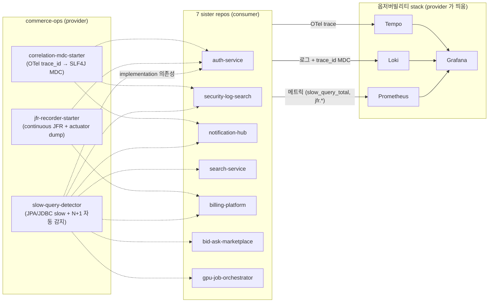

# commerce-ops

[](https://github.com/ssa1004/commerce-ops/actions/workflows/ci.yml)
[](LICENSE)
[](https://openjdk.org/projects/jdk/21/)
[](https://spring.io/projects/spring-boot)

이커머스 마이크로서비스(주문/결제/재고) 위에 **옵저버빌리티 스택 (운영 중인 시스템의 상태를 메트릭·로그·트레이스로 들여다보는 도구 모음)**, **자체 Spring Boot 운영 라이브러리**, **장애 분석 회고**를 함께 쌓아가는 production-grade observability platform 입니다.

> 운영자 관점에서 무엇을 보고 어떻게 판단했는지를 함께 기록합니다.

## 90초 데모

`POST /orders` 한 번을 던지면 — `order → inventory.reserve → payment.charge → mock-pg`까지 4개 서비스를 거치는 흐름이, **하나의 trace (요청 하나가 여러 서비스를 거치는 동안 거친 모든 작업의 타임라인)** 안에 모든 span (그 타임라인의 한 칸, 즉 서비스/메서드 단위 작업) 으로 묶여 Grafana에 그려집니다. trace에서 span을 누르면 같은 `trace_id` (요청 식별자) 의 로그로 점프하고, 결제가 실패하면 자동 보상으로 재고가 복구되며, 응답 헤더 `X-Order-Outcome`이 어떤 종류의 실패인지 분류해줍니다.

5개의 알람 룰이 SLO (Service Level Objective — 이 정도는 정상이라고 합의한 기준선) 를 모니터링하고, 알람마다 [런북 (알람이 떴을 때 어디부터 보고 어떻게 진정시킬지를 적어둔 절차서)](docs/runbook/)이 어디부터 볼지 안내합니다. 카오스 (의도적으로 장애를 주입해 시스템 반응을 보는 실험) 로 발견한 첫 부정합 사례는 [case-studies/](case-studies/)에 회고로 남아 있습니다.

## 무엇이 들어있나

- **3개 마이크로서비스** (Spring Boot 3.5 / Java 21): `order` → `payment` → `inventory`, 서비스끼리 REST 동기 호출로 묶고 + SAGA (한 흐름이 여러 서비스에 걸쳐 있을 때, 중간에 실패하면 앞단계를 되돌리는 보상 패턴) 로 실패 보상
- **Outbox 패턴** (order-service): DB 변경과 같은 트랜잭션 안에서 "보낼 이벤트"를 별도 테이블 행으로 같이 저장하고, 별도 폴러 (주기적으로 미발행 행을 긁어 Kafka에 보내는 백그라운드 작업) 가 발행. `SELECT … FOR UPDATE SKIP LOCKED` 로 여러 폴러 인스턴스가 같은 행을 겹쳐 보내지 않게 막음
- **옵저버빌리티 스택**: OpenTelemetry (벤더 중립 표준 — 어느 백엔드든 같은 코드로 보낼 수 있음) → Prometheus (메트릭 — 시간에 따른 숫자 추이) + Loki (로그 — 텍스트 메시지) + Tempo (트레이스 — 요청별 호출 흐름) → Grafana 시각화. trace ↔ log 양방향 점프하도록 데이터소스 자동 설정
- **5개 알람 + 런북**: 응답시간 p99 (전체 요청을 빠른 순으로 줄세웠을 때 99번째 — 즉 가장 느린 1% 의 컷오프), 5xx 비율, HikariCP (DB 커넥션 풀) 포화, GC pause (가비지 컬렉션이 앱을 잠시 멈추는 시간), 분산락 timeout — 각각 발화 조건/영향/진단 흐름/완화책/사후 분석 (post-mortem) 가이드
- **장애 분석 회고**: 카오스로 장애 주입 → 트레이스로 원인 분석 → 데이터 부정합 사례 ([case-studies/2026-05-07-payment-timeout-race.md](case-studies/2026-05-07-payment-timeout-race.md))

전체 구조와 설계 결정의 배경은 [ARCHITECTURE.md](ARCHITECTURE.md) / [docs/decision-log.md](docs/decision-log.md) 참고.

---

## Portfolio Set 통합

본 레포는 8 개 학습 레포 중 한 자리입니다. 다른 7 개는 각자 도메인 (인증, 보안 로그, 알림, 검색, 결제, 리셀 거래소, GPU 잡) 을 담고, 본 레포는 그 위에 깔리는 *운영 라이브러리 (starter)* 와 *옵저버빌리티 스택* 을 제공합니다. starter 만 가져다 쓰면 어느 레포든 자동으로 slow query / JFR / correlation MDC 가 켜집니다.

| Repo | 도메인 | 본 레포와의 관계 |
|---|---|---|
| [auth-service](https://github.com/ssa1004/auth-service) | OAuth2 / OIDC IdP, JWT 발행 + JWK rotation | starter consumer. 본 레포 통합 데모에서 JWK Set stub 으로 mock |
| [security-log-search](https://github.com/ssa1004/security-log-search) | SIEM 로그 수집/정규화/검색 (Kafka + OpenSearch + ClickHouse + Flink) | starter consumer |
| [notification-hub](https://github.com/ssa1004/notification-hub) | 다채널 알림 fan-out (push/email/SMS/카카오) | starter consumer |
| [search-service](https://github.com/ssa1004/search-service) | 상품 검색 (ES + CDC + alias swap) | starter consumer |
| [billing-platform](https://github.com/ssa1004/billing-platform) | B2B 결제/청구/정산 (실시간 + 사용량 기반) | starter consumer |
| [bid-ask-marketplace](https://github.com/ssa1004/bid-ask-marketplace) | 한정판 리셀 거래소 (ASK/BID 매칭) | starter consumer |
| [gpu-job-orchestrator](https://github.com/ssa1004/gpu-job-orchestrator) | GPU 학습/추론 잡 오케스트레이션 (K8s Job + 콜백) | starter consumer |
| **commerce-ops** (본 레포) | 이커머스 마이크로서비스 + 옵저버빌리티 + Spring Boot Ops Toolkit (starter 3 종) | starter provider |

> 프로필 README: <https://github.com/ssa1004/ssa1004>

### 다른 7 레포가 본 레포의 starter 를 어떻게 쓰나



### Starter 한 줄 설명 + 사용법

| Starter | 한 줄 설명 | 다른 레포에서 쓰는 법 |
|---|---|---|
| `slow-query-detector` | JPA/JDBC slow query + N+1 패턴 자동 감지 → `slow_query_total` / `n_plus_one_total` 카운터 | `implementation("io.minishop:slow-query-detector:0.1.0-SNAPSHOT")` |
| `jfr-recorder-starter` | JFR continuous profiling 24/7 + `/actuator/jfr` ad-hoc dump + S3/MinIO 자동 업로드 | `implementation("io.minishop:jfr-recorder-starter:0.1.0-SNAPSHOT")` |
| `correlation-mdc-starter` | OTel `Span.current()` → SLF4J MDC `trace_id` / `span_id` 자동 동기화 | `implementation("io.minishop:correlation-mdc-starter:0.1.0-SNAPSHOT")` |

전부 Spring Boot AutoConfiguration — *의존성만 추가하면 자동 활성*. 끄고 싶으면 각 starter 의 `mini-shop.<name>.enabled=false`. 자세한 내부 동작은 [`modules/<name>/README.md`](modules/) 참조.

### 통합 데모 한 번에 띄우기

```bash
docker compose \
  -f infra/docker-compose.yml \
  -f infra/docker-compose.integration.yml \
  up -d
./scripts/integration-demo.sh
```

`docker-compose.integration.yml` 은 기존 옵저버빌리티 stack 위에 *auth-service stub (JWK Set)* 만 추가합니다 — 7 sister repo 들이 JWT 검증을 통합 시연할 수 있도록. `integration-demo.sh` 는 mock JWT 으로 `POST /orders` → trace_id 로 Loki 로그 ↔ Tempo trace 점프 → slow query 일부러 발생 → JFR ad-hoc dump 까지 한 흐름으로 실행합니다.

---

## System Overview

```
┌──────────┐     ┌──────────┐     ┌────────────┐
│  order   │ ──▶ │ payment  │     │ inventory  │
│ service  │     │ service  │     │  service   │
└────┬─────┘     └────┬─────┘     └─────┬──────┘
     │  Kafka events (order/payment/inventory.events)
     ├────────────────┴─────────────────┤
     │                                  │
┌────▼──────────────────────────────────▼────┐
│           OpenTelemetry Collector          │
└────┬──────────────┬──────────────┬─────────┘
     │              │              │
┌────▼─────┐  ┌─────▼────┐  ┌──────▼─────┐
│Prometheus│  │   Loki   │  │   Tempo    │
└────┬─────┘  └─────┬────┘  └──────┬─────┘
     └──────────────┼──────────────┘
                    ▼
              ┌──────────┐
              │ Grafana  │
              └──────────┘
```

## 진행 상황

| Phase | 상태 |
|---|---|
| **Phase 0** — 레포 스캐폴드 + 인프라 설정 | ✅ |
| **Phase 1** — 3개 서비스 + 동기 SAGA + JVM/HTTP 대시보드 | ✅ |
| **Phase 2** — OTel 자동계측, Tempo/Loki, 알람 5개, Outbox/Inbox + reconciliation, tail-based sampling, 첫 케이스 스터디 | ✅ (Step 3c — choreography 만 남음) |
| **Phase 3** — 자체 Spring Boot 운영 라이브러리 (`modules/`) | 진행 중 (4/5 — slow-query-detector, jfr-recorder-starter, correlation-mdc-starter, actuator-extras v0.1 / chaos-injector 만 설계 단계) |
| **Phase 4** — 카오스 시나리오 누적 + 케이스 스터디 누적 (지속) | 진행 중 |

자세한 단계는 [ROADMAP.md](ROADMAP.md) 참고.

---

## Quick Start

### 1. 인프라 띄우기

```bash
docker compose -f infra/docker-compose.yml up -d
```

Postgres, Redis, Kafka, Prometheus, Loki, Tempo, Grafana, Alertmanager가 한 번에 올라옵니다. Grafana는 데이터소스와 대시보드까지 자동 프로비저닝됩니다.

| URL | 용도 |
|---|---|
| http://localhost:3000 | Grafana — `admin / admin` |
| http://localhost:9090 | Prometheus (`/alerts`에서 발화 중인 알람 확인) |
| http://localhost:3200 | Tempo |
| http://localhost:9093 | Alertmanager |

설정만 검증하려면: `docker compose -f infra/docker-compose.yml config`

### 2. 서비스 3개 실행

```bash
# 각각 다른 셸에서
cd services/order-service     && ./gradlew bootRun   # :8081
cd services/payment-service   && ./gradlew bootRun   # :8082
cd services/inventory-service && ./gradlew bootRun   # :8083
```

JDK 21이 없어도 됩니다 — Gradle 툴체인이 foojay에서 자동 다운로드합니다.

### 3. 흐름 직접 만져보기

```bash
# 정상 — 201 Created, status=PAID
curl -s -X POST localhost:8081/orders \
  -H 'Content-Type: application/json' \
  -d '{"userId":42,"items":[{"productId":1001,"quantity":2,"price":9990}]}' | jq

# 결제 항상 실패 시뮬레이션 — 402 PAYMENT_DECLINED + 재고 자동 복구
# (payment-service를 MOCK_PG_FAILURE_RATE=1.0 으로 재시작한 뒤)
curl -i -X POST localhost:8081/orders \
  -H 'Content-Type: application/json' \
  -d '{"userId":42,"items":[{"productId":1001,"quantity":1,"price":9990}]}'

# 재고 부족 — 409 OUT_OF_STOCK + 앞에서 reserve된 다른 아이템 자동 복구
curl -i -X POST localhost:8081/orders \
  -H 'Content-Type: application/json' \
  -d '{"userId":42,"items":[{"productId":1003,"quantity":9999,"price":9990}]}'
```

응답 헤더 `X-Order-Outcome`에 `OUT_OF_STOCK / PAYMENT_DECLINED / INVENTORY_INFRA / PAYMENT_INFRA` 분류가 실립니다 — 5xx 디버깅 없이 어디서 막혔는지 클라이언트가 바로 알 수 있도록.

### 4. 부하 테스트 (선택)

```bash
k6 run load/baseline.js
```

### 5. Grafana에서 메트릭 → 로그 → 트레이스 점프

OpenTelemetry가 3개 서비스를 자동 계측 (코드 수정 없이 표준 라이브러리·프레임워크 호출을 가로채 trace/메트릭을 만드는 방식) 하고 있어, 한 요청을 trace 하나로 묶어 보여줍니다.

- **대시보드** — Grafana → Dashboards → **JVM + HTTP** (3개 서비스 통합)
- **트레이스** — Grafana → Explore → **Tempo** → 최근 trace 클릭. order/inventory/payment/mock-pg 5~7개 span이 한 그림.
- **로그** — Tempo span에서 *"Logs for this span"* 클릭하면 Loki에서 같은 `trace_id`만 자동 필터. 역방향도 가능.
- **콘솔** — 서비스 stdout 에도 `[trace_id/span_id]`가 같이 찍혀 grep 으로 한 요청을 추적 가능.

---

## Kubernetes 배포 (Helm)

3 마이크로서비스 (order / payment / inventory) 를 한 release 로 묶는 **umbrella chart**가 `helm/mini-shop/` 에 있습니다. starter 모듈 (`modules/`) 은 7 sister repo 가 dependency 로 가져다 쓰는 라이브러리라 chart 가 없고, 옵저버빌리티 stack (Prometheus / Grafana / Loki / Tempo) 도 외부 helm chart (`kube-prometheus-stack`, `loki-stack`, `tempo-distributed`) 사용을 가정해 본 chart 에 포함하지 않습니다.

```
helm/mini-shop/
├── Chart.yaml                     # umbrella + 3 sub-chart dependency
├── values.yaml                    # dev 기본 (3 sub-chart 공통 global + 각 override)
├── values-prod.yaml               # prod override (replicas / HPA / PDB / NetworkPolicy)
├── templates/
│   ├── ingress.yaml               # 단일 host 에서 path 기반 fan-out
│   └── NOTES.txt
└── charts/
    ├── order-service/             # SAGA orchestration + Outbox
    ├── payment-service/           # mock-pg + 외부 PG 연동
    └── inventory-service/         # Redisson 분산락 + 멱등성
```

각 sub-chart 의 `templates/` 에는 deployment / service / configmap / secret / serviceaccount / hpa / pdb / networkpolicy / ingress / `_helpers.tpl` 가 있습니다. ingress 는 umbrella 의 fan-out 이 정상 경로 (단일 host `mini-shop.example.com` 에서 `/api/v1/orders/*`, `/api/v1/payments/*`, `/api/v1/inventory/*` 분기) 이고, sub-chart 의 ingress 는 단독 install 이 필요할 때만 enable.

### 빠르게 검증

```bash
# 1. sub-chart 들을 charts/ 에 packaged
helm dep update helm/mini-shop

# 2. lint
helm lint helm/mini-shop
helm lint helm/mini-shop --values helm/mini-shop/values-prod.yaml

# 3. 매니페스트 미리보기 (kubectl apply 안 함)
helm template mini-shop helm/mini-shop --namespace mini-shop
helm template mini-shop helm/mini-shop \
  --values helm/mini-shop/values-prod.yaml --namespace mini-shop
```

### 배포

```bash
# dev 클러스터 (kind / minikube / 사내 dev)
helm upgrade --install mini-shop helm/mini-shop \
  --namespace mini-shop --create-namespace \
  --set global.image.tag=$(git rev-parse --short HEAD)

# prod
helm upgrade --install mini-shop helm/mini-shop \
  --namespace mini-shop --create-namespace \
  --values helm/mini-shop/values.yaml \
  --values helm/mini-shop/values-prod.yaml \
  --set global.image.tag=<release-sha>
```

배포되는 리소스 (3 service × 8 종 + umbrella ingress):

| 리소스 | 개수 | 비고 |
|---|---|---|
| Deployment / Service / ServiceAccount | 3 each | 3 마이크로서비스 |
| ConfigMap / Secret | 3 each | global 의 DB / Redis / Kafka / OTel endpoint 주입 |
| HPA | 3 | `autoscaling.enabled=true` (운영 default) |
| PDB | 3 | `podDisruptionBudget.enabled=true` (운영 default) |
| NetworkPolicy | 3 | `global.networkPolicy.enabled=true` (운영 default) |
| Ingress | 1 (umbrella) | `mini-shop.example.com` 에서 path 기반 fan-out |

### 외부 의존

본 chart 는 *외부 의존을 자체 포함하지 않습니다* — 클러스터에 미리 있다고 가정하고 endpoint 만 주입합니다.

- **Postgres** — `global.postgres.host`. 운영은 RDS / Aurora 등.
- **Redis** — `global.redis.host`. 운영은 ElastiCache 등 (inventory-service 의 분산락 용도).
- **Kafka** — `global.kafka.bootstrapServers`. 운영은 MSK 등.
- **OTel Collector** — `global.otel.host`. `infra/otel-collector/` 와 같은 설정의 Deployment 또는 DaemonSet 을 별도 release 로 배포.
- **옵저버빌리티 stack** — `kube-prometheus-stack` / `loki-stack` / `tempo-distributed` 등 외부 helm chart 를 별도 release 로.

### Secret 운영

dev 는 chart 가 직접 `Secret` 을 만듭니다 (`secret.create=true`, DB password 가 평문). 운영은:

```yaml
# values-prod.yaml 에서 sub-chart 별로
order-service:
  secret:
    create: false           # chart 의 평문 Secret 비활성
  extraEnvFrom:
    - secretRef:
        name: order-service-vault-secrets   # ExternalSecret / SealedSecret 결과
```

ExternalSecret / SealedSecret 으로 미리 만들어 둔 Secret 을 `extraEnvFrom` 으로 참조하는 게 정석입니다.

---

## 추천 읽는 순서

빠르게 훑을 때:

1. **여기 README 상단** — 레포의 범위
2. [ARCHITECTURE.md](ARCHITECTURE.md) — 컴포넌트와 데이터 흐름
3. [docs/decision-log.md](docs/decision-log.md) — trade-off (한쪽을 얻기 위해 다른 쪽을 양보한 결정) 기록 (ADR — Architecture Decision Record, 어떤 선택을 했는지 짧게 기록한 메모)
4. [case-studies/](case-studies/) — 실제 부딪힌 사례
5. [docs/runbook/](docs/runbook/) — 알람이 떴을 때의 대응 절차

서비스/인프라 코드를 보려면 각 디렉토리의 README:
- [services/order-service/README.md](services/order-service/README.md) — SAGA orchestration (한 서비스가 흐름을 직접 지휘하며 실패 시 보상까지 책임지는 방식) + Outbox
- [services/inventory-service/README.md](services/inventory-service/README.md) — Redisson 분산락 (여러 인스턴스가 같은 자원에 동시 접근 못 하게 Redis로 잠그는 도구) + 멱등성 (같은 요청이 두 번 와도 결과가 한 번 처리한 것과 같음)
- [services/payment-service/README.md](services/payment-service/README.md) — mock PG (외부 결제사를 흉내 내는 가짜 서버) + afterCommit publish (DB 트랜잭션이 커밋 완료된 직후에 이벤트 발행)
- [infra/README.md](infra/README.md) — 옵저버빌리티 스택 운영 가이드
- [modules/README.md](modules/README.md) — Phase 3 자체 라이브러리 설계

---

## Repository Layout

```
commerce-ops/
├── README.md / ARCHITECTURE.md / ROADMAP.md
├── docs/
│   ├── decision-log.md      # ADR 25개
│   ├── runbook/             # 알람별 대응 절차
│   └── slo.md
├── services/
│   ├── order-service/       # 주문 + SAGA + Outbox
│   ├── payment-service/     # 결제 + mock-pg
│   └── inventory-service/   # 재고 + 분산락
├── modules/                 # Phase 3: 자체 Spring Boot 운영 라이브러리 (3/5 구현)
├── infra/                   # docker-compose + Prometheus/Grafana/Loki/Tempo/Alertmanager 설정
├── helm/mini-shop/          # K8s 배포 — umbrella chart (3 sub-chart: order/payment/inventory)
├── load/                    # k6 시나리오
├── chaos/                   # 장애 주입 시나리오
├── case-studies/            # 실제 부딪힌 케이스 회고
└── .github/workflows/       # CI: docker compose / promtool / amtool / Gradle build
```

---

## License

MIT
