# Screenshots & visual walkthrough

> **English** · [한국어 ↓](#한국어)

This folder holds the **visual proof** for the observability flow described in the
root [README](../../README.md): a single `POST /orders` fanning out across
`order → inventory → payment → mock-pg`, stitched into one trace, with bidirectional
trace↔log jumps, JVM/HTTP dashboards, and firing alerts.

The architecture diagram below is generated from
[`../diagrams/architecture.mmd`](../diagrams/architecture.svg) and is committed, so it
renders even before you bring the stack up:



The screenshots themselves are **not committed** — they depend on a live Docker stack and
real traffic, and this repo never ships fabricated images. Instead, this page gives the
**exact commands** to bring everything up and capture each image yourself. Drop the PNGs
next to this file using the filenames in the table and they will render in this README.

| File | What it shows | Where to capture |
|---|---|---|
| `01-tempo-trace.png` | Tempo trace of the `order → inventory.reserve → payment.charge → mock-pg` flow (one trace, 5–7 spans) | Grafana → Explore → Tempo |
| `02-logs-for-this-span.png` | The *"Logs for this span"* jump from a Tempo span into Loki, auto-filtered to the same `trace_id` | Grafana → Explore → Tempo → span → Logs |
| `03-jvm-http-dashboard.png` | The **JVM + HTTP** dashboard (uid `jvm-http`) across the 3 services | Grafana → Dashboards → JVM + HTTP |
| `04-firing-alert.png` | A firing alert rule in Prometheus (e.g. `order_p99_latency_high`) | Prometheus → `/alerts` |

---

## 0. Prerequisites

- Docker (Compose v2) running. Verify with `docker compose version`.
- JDK is optional — the Gradle toolchain auto-downloads JDK 21 via foojay.
- `curl`, and optionally `k6` (0.42+) for load.

## 1. Bring up infra + the 3 services

```bash
# from repo root

# (a) observability + datastores
make up
# == docker compose -f infra/docker-compose.yml up -d
#    (Postgres, Redis, Kafka, OTel Collector, Prometheus, Loki, Tempo, Grafana, Alertmanager)

# (b) the 3 application services, each in its own shell (host JVM — see ADR-008:
#     Prometheus scrapes them over host.docker.internal)
make run-order        # cd services/order-service     && ./gradlew bootRun   → :8081
make run-payment      # cd services/payment-service   && ./gradlew bootRun   → :8082
make run-inventory    # cd services/inventory-service && ./gradlew bootRun   → :8083
```

Wait until each service answers `200`:

```bash
for p in 8081 8082 8083; do curl -fsS "localhost:$p/actuator/health" && echo " ← :$p ok"; done
```

Grafana is at <http://localhost:3000> (`admin` / `admin`) with datasources and dashboards
auto-provisioned.

## 2. Generate the trace — one `POST /orders`

```bash
make demo
# == ./scripts/integration-demo.sh
# Mints a mock JWT + a W3C traceparent, fires POST /orders, and prints the trace_id plus
# ready-made Tempo / Grafana / Loki URLs for that exact trace.
```

Or do it by hand and keep the `trace_id` you send:

```bash
TRACE_ID=$(openssl rand -hex 16)
curl -s -X POST localhost:8081/orders \
  -H 'Content-Type: application/json' \
  -H "traceparent: 00-${TRACE_ID}-$(openssl rand -hex 8)-01" \
  -d '{"userId":42,"items":[{"productId":1001,"quantity":2,"price":9990}]}' | jq
echo "trace_id = ${TRACE_ID}"
```

### (a) Capture `01-tempo-trace.png`

1. Grafana → **Explore** → datasource **Tempo**.
2. Query by **TraceID** = the `trace_id` printed above (or use **Search** → service `order-service`
   → newest trace).
3. You should see one trace with the `order → inventory → payment → mock-pg` spans nested.
4. Screenshot the waterfall → save as `docs/screenshots/01-tempo-trace.png`.

### (b) Capture `02-logs-for-this-span.png`

1. In the same trace, click any span (e.g. the `order-service` root span).
2. Click **"Logs for this span"** (wired via the Tempo datasource `tracesToLogsV2` →
   Loki in [`infra/grafana/provisioning/datasources/datasources.yml`](../../infra/grafana/provisioning/datasources/datasources.yml)).
3. Loki opens already filtered to `{application="order-service"} | trace_id="<id>"`
   — the `correlation-mdc-starter` injects `trace_id`/`span_id` into the SLF4J MDC.
4. Screenshot → save as `docs/screenshots/02-logs-for-this-span.png`.

> The reverse jump also works: in a Loki log line, the derived field **TraceID** links
> back to the Tempo trace.

## 3. Capture `03-jvm-http-dashboard.png`

1. Grafana → **Dashboards** → **JVM + HTTP** (uid `jvm-http`), or open
   <http://localhost:3000/d/jvm-http>.
2. Drive a little traffic first so the panels have data:
   ```bash
   for i in $(seq 1 50); do
     curl -s -o /dev/null -X POST localhost:8081/orders \
       -H 'Content-Type: application/json' \
       -d '{"userId":42,"items":[{"productId":1001,"quantity":1,"price":9990}]}'
   done
   # or: k6 run load/baseline.js
   ```
3. Screenshot → save as `docs/screenshots/03-jvm-http-dashboard.png`.

> Other provisioned dashboards worth a shot: **Slow Query & N+1** (uid `slow-query`),
> **Portfolio Load (k6 + actuator)** (uid `portfolio-load`), **Mini Shop Infra Overview**.

## 4. Capture `04-firing-alert.png` — make an alert fire

The repo ships **8 alert rules** in [`infra/prometheus/alerts.yml`](../../infra/prometheus/alerts.yml),
each linked to a [runbook](../runbook/). The easiest to force is the error-rate / latency
pair on `order-service`.

**Option A — force 5xx (fires `order_error_rate_spike`, P1):** restart `payment-service`
so its mock PG always 5xx's, then send orders:

```bash
# in the payment-service shell
MOCK_PG_FAILURE_RATE=1.0 ./gradlew bootRun   # mock PG declines/errors every charge
```

```bash
for i in $(seq 1 60); do
  curl -s -o /dev/null -X POST localhost:8081/orders \
    -H 'Content-Type: application/json' \
    -d '{"userId":42,"items":[{"productId":1001,"quantity":1,"price":9990}]}'
done
```

**Option B — force latency (fires `order_p99_latency_high`, P2):** run the peak load
profile, which pushes p99 over the 500ms SLO:

```bash
k6 run load/peak.js
```

Then:

1. Open Prometheus → <http://localhost:9090/alerts>.
2. Wait for the `for:` window (3–5m) — the rule goes `Pending` → `Firing` (red).
3. Screenshot → save as `docs/screenshots/04-firing-alert.png`.
4. Routing target: Alertmanager → <http://localhost:9093>.

> Alert ↔ runbook map: each rule's `runbook_url` annotation points at
> `docs/runbook/<alert>.md`. Capturing the runbook open next to the firing alert makes a
> strong "from alert to action" frame.

## 5. Tear down

```bash
make down     # keep volumes
make clean    # drop volumes (docker compose down -v)
```

---

## Re-rendering the architecture diagram

The committed SVG is generated from the Mermaid source. If you edit
[`../diagrams/architecture.mmd`](../diagrams/architecture.mmd), regenerate it with:

```bash
npx -y @mermaid-js/mermaid-cli@11 \
  -i docs/diagrams/architecture.mmd \
  -o docs/diagrams/architecture.svg
```

---

<a name="한국어"></a>

## 한국어

이 폴더는 루트 [README](../../README.md) 가 설명하는 옵저버빌리티 흐름의 **시각 증거** 를 담는
자리입니다: `POST /orders` 한 번이 `order → inventory → payment → mock-pg` 로 퍼지고,
하나의 trace 로 묶이며, trace↔log 양방향 점프 / JVM·HTTP 대시보드 / 발화 중인 알람까지.

아래 아키텍처 다이어그램은 [`../diagrams/architecture.mmd`](../diagrams/architecture.svg)
에서 생성되어 커밋돼 있어, 스택을 띄우기 전에도 렌더됩니다:


스크린샷 PNG 자체는 **커밋하지 않습니다** — 살아있는 Docker 스택과 실제 트래픽이 필요하고,
본 레포는 절대 **가짜 이미지를 만들지 않습니다**. 대신 이 문서는 각 이미지를 직접 캡처하는
**정확한 명령** 을 제공합니다. 아래 표의 파일명으로 PNG 를 이 폴더에 떨어뜨리면 이 README 에
바로 렌더됩니다.

| 파일 | 무엇을 보여주나 | 캡처 위치 |
|---|---|---|
| `01-tempo-trace.png` | `order → inventory.reserve → payment.charge → mock-pg` 흐름의 Tempo trace (한 trace, 5~7 span) | Grafana → Explore → Tempo |
| `02-logs-for-this-span.png` | Tempo span 에서 *"Logs for this span"* 으로 같은 `trace_id` Loki 로그로 점프 | Grafana → Explore → Tempo → span → Logs |
| `03-jvm-http-dashboard.png` | 3 서비스 통합 **JVM + HTTP** 대시보드 (uid `jvm-http`) | Grafana → Dashboards → JVM + HTTP |
| `04-firing-alert.png` | Prometheus 에서 발화 중인 알람 (예: `order_p99_latency_high`) | Prometheus → `/alerts` |

캡처 절차는 위 영어 섹션 1~5 단계와 동일합니다 (`make up` → 서비스 3개 `bootRun` →
`make demo` 로 trace 생성 → Grafana/Prometheus 에서 각 화면 캡처). 알람은
[`infra/prometheus/alerts.yml`](../../infra/prometheus/alerts.yml) 의 8개 룰 중
`order_error_rate_spike` (결제 5xx 강제) 또는 `order_p99_latency_high` (`k6 run load/peak.js`)
가 가장 띄우기 쉽습니다.
